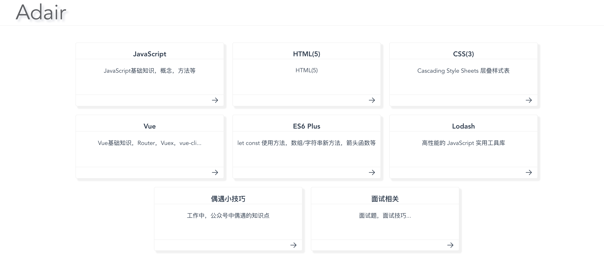

# adair
Vue2 hello world

### 引用element ui
* 安装 npm i element-ui -S
* main.js引用   
  import ElementUI from 'element-ui'  
  Vue.use(ElementUI)  

### 引用路由
* 在router.js中定义路由，导出router实例
* 在main.js中引入 import Router from './router/router'

### 全局样式
* main.js中import './styles'

### src/md 
* 使用 markdown 记录知识点，包括 webpack vue js 等

### src/directive
* 全局指令封装注册

### src/mixin
* mixin 相关

### src/router
* 路由相关

### src/store
* vuex 相关

### src/components
* 组件封装 
### src/components/js
* js 相关属性 方法 练习文件，原生 es6+ 新方法属性等
### 模块


### troubleshooting
- src/troubleshooting.md

### eslint 集成
- .eslintrc.js 集成时新装了一些依赖
```json
"babel-eslint": "^10.0.1",
"babel-plugin-component": "^1.1.1",
"eslint": "^5.8.0",
"eslint-plugin-vue": "^5.0.0",
```
- f2elint 集成时 遇到了一些问题 后改为 eslint

